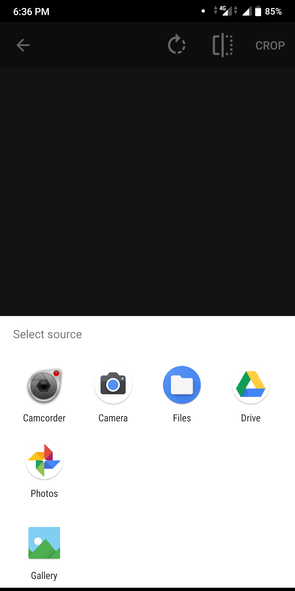

# MP10
It is part of mini project(B.Tech 3rd year). It uses google ML Kit to recognise human faces &amp; smile probability of each face detected.

                                        

This is very simple imaplementation of Image Processing using android studiio. It uses Google ML kit to detect human face and smile. To 
 use this project just clone the project & run it in the Android Studio. Incase the gradle & sdk components are outdated just update all 
  the plugins and run the project and you are good to go.  
